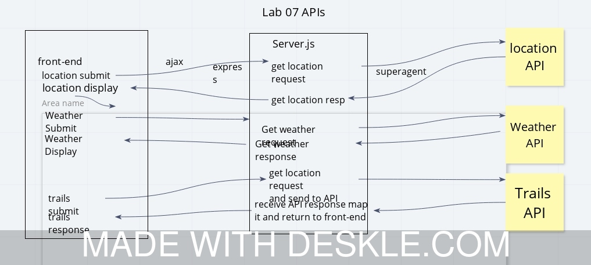

# lab06

**Author**: Peter Sankiewicz

**Version**: 2.0.0

**GitHub**: [https://github.com/petsan/lab06/](https://github.com/petsan/lab06/)

## Overview
This application is a server backend.  It takes requests and returns responses.

## Getting Started
1. npm i -S express
1. npm i -S dotenv
1. npm i -S cors
1. npm i -S superagent
1. run nodemon

Or, deploy master to HEROKU

## Back-End

[https://petsan-lab06.herokuapp.com](https://petsan-lab06.herokuapp.com)

## Front-End

[https://codefellows.github.io/code-301-guide/curriculum/city-explorer-app/front-end/](https://codefellows.github.io/code-301-guide/curriculum/city-explorer-app/front-end/)

## Architecture

Node with Express, and SuperAgent

## Change Log

2.0.0 - Second feature release BUGCRAWLER

1.3.0 - Implemented Hiking Project API [https://www.hikingproject.com](https://www.hikingproject.com)

1.2.0 - Implemented Weather Bit API [https://www.weatherbit.io/](https://www.weatherbit.io/)

1.1.0 - Implemented Location IQ API [https://api.locationiq.com/](https://api.locationiq.com/)

1.0.0 - First feature release ARACHNID

0.2.1 - Aded error handling to weather

0.2.0 - Added weather route

0.1.1 - Added error handling to location

0.1.0 - Added location route

0.0.1 - Basic server

## Colaborators

Alex Whan

Joshua Williams
